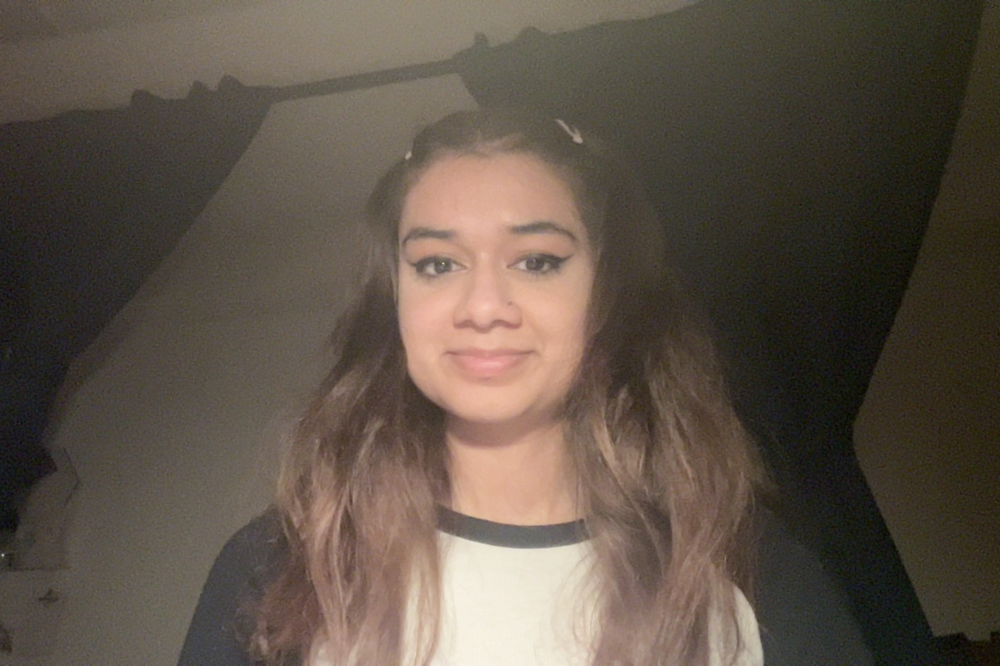
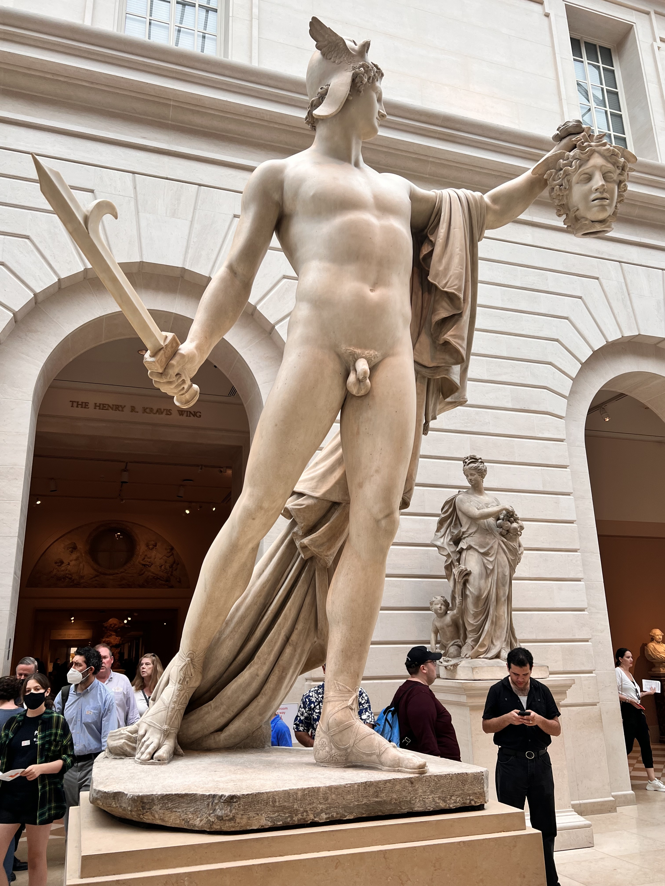
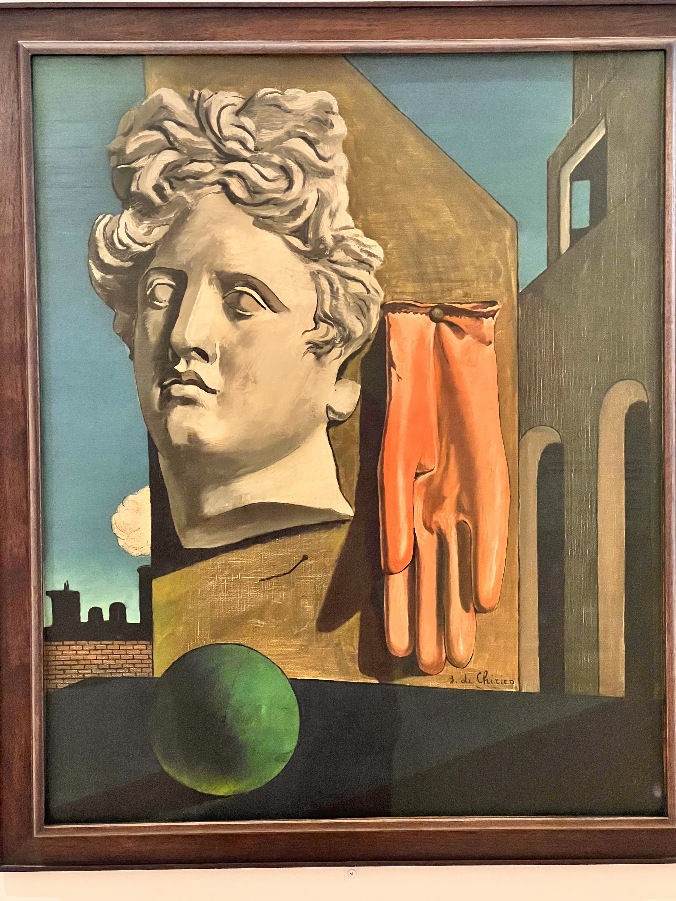
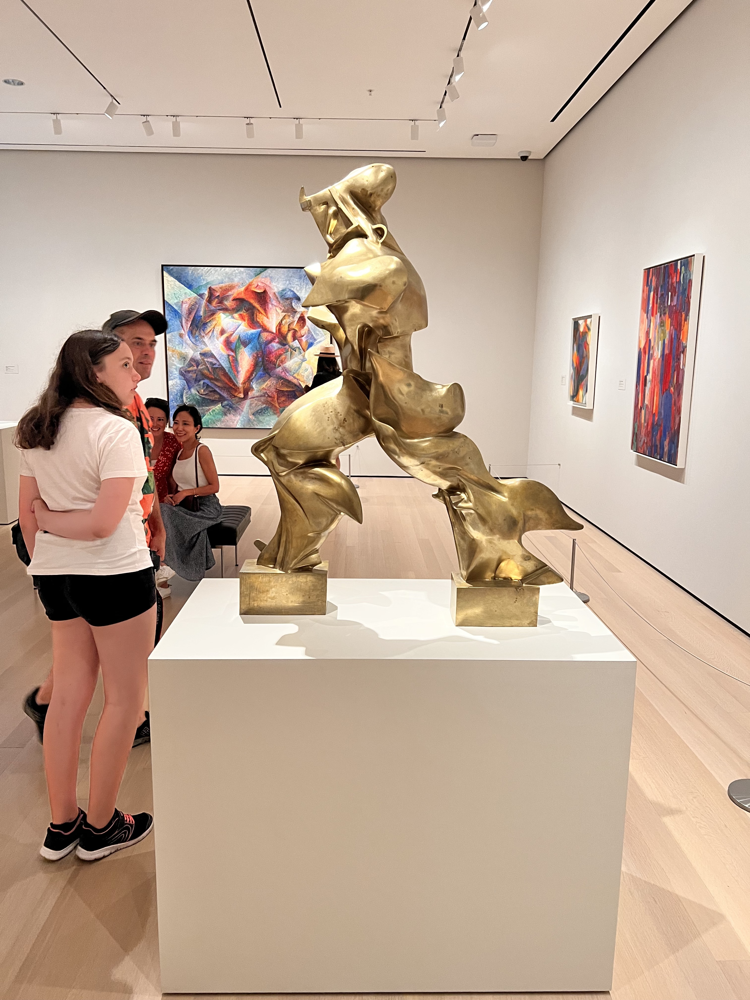
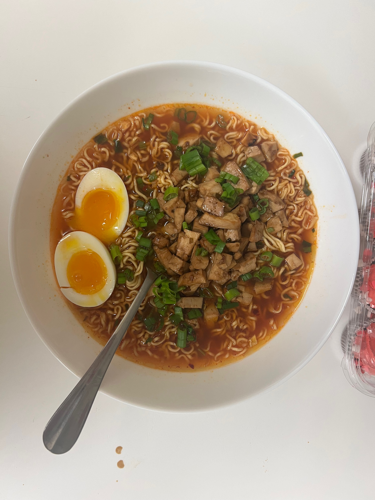
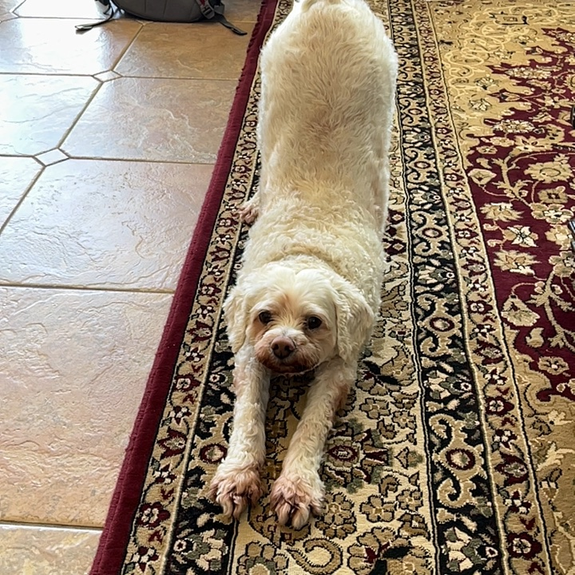

# Drishti Regmi's Personal Page

A little bit about me before we get started, my name is Drishti Regmi and I am a second year computer 
science major in Marshall college. I'm from Los Angeles, California, more specifically, from Porter Ranch.  

Here's my profile picture on Slack:

This webpage has two main parts: one pertaining to [Drishti the person](index.md-drishti-the-person), and one pertaining to Drishti the programmer

## __Part 1: Drishti the Person__ 
  First, some fun facts about me :
  
+ I really love going to art museums
        Some museums that I've been to include: [Norton Simon](https://www.nortonsimon.org/), [LACMA](https://www.lacma.org/), 
        [The Getty Villa](https://www.getty.edu/visit/villa/), [The Getty Center](https://www.getty.edu/visit/center/) , 
        [The Broad](https://www.thebroad.org/), [Borghese Gallery](https://borghese.gallery/), [The Louvre](https://www.louvre.fr/en), 
        [Museé D'Orsay](https://www.musee-orsay.fr/en), [the Vatican Museum](https://www.museivaticani.va/content/museivaticani/en.html)
+ I journal in my free time
+ I recently have been trying to cook more, and I've been finetuning my pasta, avocado toast, and kung pao chicken recipes
+ I adore picnics, and I try to have them as often as I can with my family
+ I'm on a little bit of a film journey at the moment, my favorite movie as of now is 
      [The Virgin Suicides](https://www.imdb.com/title/tt0159097/plotsummary/)
+ I have a dog named Chakra ~ *he's a malteese poodle who is strangely big for his breed?*

Although it's hard to communicate what describes you as a person through a simple web page, here are some pictures that can give you a 
better idea of my hobbies and interests and personal life:

### Some Art Adventures

> I really wish I remembered the name of this statue, but it's honestly one of my favorites

> Surrealist art is one of my favorite art styles, so it's always fun to look at Giorgio de Chirico's work

> Another one of my favorite pieces, by Umberto Boccioni

### Some Cooking Adventures

> Some honey glazed salmon I made, I almost burned the house down

> Some ramen I made in my dorm

### My Dog, Chakra

> Above is a picture of my dog, Chakra. He's ten years old and is still just as energetic as he was when we first got him. He enjoys
> making messes, going on walks, and harrassing me for my food whenever I eat a dish with meat in it

### My Favorite Movies as of Late

## __Part 2: Drishti the Programmer__

A little bit of my background as a programmer: I didn't really start coding until highschool, and even then, my exposure to coding was rather 
limited. College is when I started diving into computer science, and it's when I started to learn that computer science encompasses so much 
more than writing code. 

Here are some my favorite classes that I've taken here in the CSE department:

  1. CSE 105
  2. CSE 101
  3. CSE 100R
  4. CSE 30

 Half of the classes on the list above don't require you to write much code, and a lot of the content for those classes is very conceptual. 
 While I do enjoy theory classes, I've been trying to also develop some tcehnical skills that might come in handy for internships, jobs, and
 personal projects. A few of my programming goals for this year include:

 - [ ] Learn to use React ~ ***This is the goal that I want to achieve the most out of everything here since React is very useful and it's      
       important that I learn***
 - [ ] Learn to use Django
 - [ ] Learn HTML, Javascript, and CSS ~~(especially CSS, I'm no good at web design)~~
 - [ ] Learn to use MongoDB
 - [ ] Improve my typing speed (it's only 48 wpm which slows me down significantly)
 - [ ] Get more into Leetcode ~ *I'm probably going to focus more on this during summer*

I'm especially excited to work on a project team this quarter because I struggle a lot with coming up with creative ideas for projects. One of 
my biggest points of contention is how to come up with a project idea that is not only challenging enough to teach me new things, but one that 
is fairly unique. What's challenging for me is that I usually start off by googling basic project ideas and tutorials that have already been 
done 1000 times over (usually things like typeracers or to-do lists, ***and God knows we have enough of those***) and I end up getting 
frustrated that I can't come up with something new. I think that working on a team with diverse programming backgrounds will help me gain
some insight as to how people come up with new ideas for their projects. 

    

